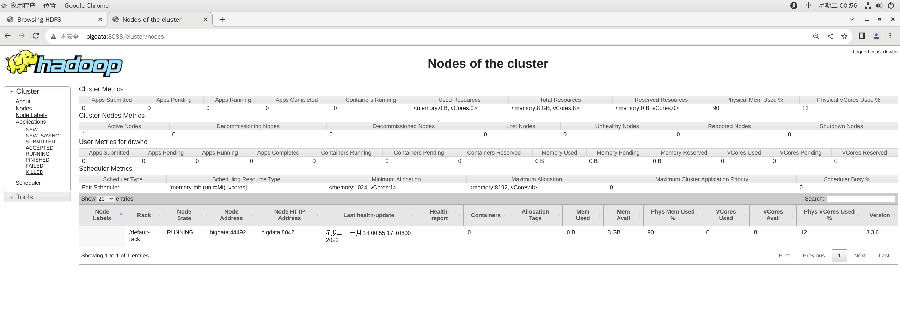

# 实验二  Mapreuce与借贷违规

> 实验人：211275023王子垚
>
> 实验时间：2023.11.08-2023.11.15
>
> 实验目的：在借贷交易中，银行和其他金融机构通常提供资金给借款人，期望借款人能够按时还款本金和利息。然而，由于各种原因，有时借款人可能无法按照合同规定的方式履行还款义务，从而导致贷款违约。本次实验以银行贷款违约为背景，选取了约30万条贷款信息 ，包含在application_data.csv文件中，通过mapreduce编程实现目的。
>
> 实验材料：VMWare Workstation，Cent OS7虚拟机，Finalshell运行终端。伪分布式运行。
>
> 编程环境：Java，IDEA。

## 问题一

> 编写MapReduce程序，统计数据集中违约和非违约的数量，按照标签TARGET进行输出，即1代
> 表有违约的情况出现，0代表其他情况。
> 输出格式：
> <标签><交易数量>
> 例：
> 1 100

#### 数据分析与预处理

这里首先使用python对数据进行分析，缺失值填充，类型转换，描述性统计等功能，便于数据的完整性和可用性，便于后续操作。

```python
# %%
import numpy as np
import pandas as pd
import matplotlib.pyplot as plt

# %%
#读入数据
data = pd.read_csv('./application_data.csv')

data.describe()

# %%
#将所有空缺值删除
data = data.dropna(axis=0,how='any')

# %%
data.info()

# %%
#将data34-59列取整
data.iloc[:,34:59] = data.iloc[:,34:59].astype(int)

# %%
data.iloc[:,34:59].describe()

# %%
#将data34-59列只保留整数部分

# %%
data.to_csv('./application_data_fillna.csv',float_format="%.0f", index=False)

# %%
data.columns

# %%
#提取所有的object类型的列
data_obj = data.select_dtypes(include=['int','float'])
data_obj.columns

# %%
data_obj.var()

# %%
#选择方差大于0.15的列
data_obj = data_obj.loc[:,data_obj.var()>0.15]

# %%
data_obj

# %%
# 将data的TARGET列合并到data_obj中
data_obj['TARGET'] = data['TARGET']

# %%
#将target列放到第一列
cols = list(data_obj.columns)
cols.insert(1,cols.pop(cols.index('TARGET')))
data_obj = data_obj.loc[:,cols]


# %%
data_obj

# %%
#除了前两列，其他列进行归一化
from sklearn.preprocessing import MinMaxScaler
scaler = MinMaxScaler()
data_obj.iloc[:,2:] = scaler.fit_transform(data_obj.iloc[:,2:])
data_obj

# %%
#除了前两列，其他列*100，然后取整
data_obj.iloc[:,2:] = data_obj.iloc[:,2:]*100
#data_obj.iloc[:,2:] = data_obj.iloc[:,2:].astype(int)
data_obj.info()

# %%
#删除有空值的行
data_obj.dropna(axis=0,how='any',inplace=True)

# %%
data_obj.iloc[:,2:] = data_obj.iloc[:,2:].astype(int)

# %%
data_obj.info()

# %%
#写回
data_obj.to_csv('./processed_data.csv',index=False)


```

处理过后数据完整而规范：


并且，为了KNN考虑，需要挑选出规范化且方差较为明显的列进行训练（否则有些列几十万条0只有几个1很浪费计算资源）

#### 解题思路

- 在MapReduce中，数据被分割成若干个块，每个块由一个Map任务处理。
- Reduce任务收集所有具有相同键的值，对这些值进行归约操作。
- 确保在Map阶段和Reduce阶段的输出键值对格式一致。

1. **Map阶段：**
   - 读取数据集中的每一条记录。
   - 对于每一条记录，提取 `TARGET` 字段的值作为键，值为1。
   - 输出键值对 `<TARGET, 1>`。
2. **Reduce阶段：**
   - 收到Map阶段输出的键值对。
   - 对于每一个键值对，累加值，即统计每个标签出现的次数。
   - 输出键值对 `<TARGET, 总数>`。

#### 代码解读

具体在代码中体现，只展现关键类。先展示主函数，后面主函数都差不多就不赘述了。

```java
package task1;
/*
    实验背景：银行贷款违约为背景，任务一为编写mapreduce程序，统计数据集中违约和不违约的数量
    按照标签target进行输出，输出格式为<标签><交易数量>，如1 100
*/
import java.io.IOException;
import org.apache.hadoop.conf.Configuration;
import org.apache.hadoop.fs.Path;
import org.apache.hadoop.io.*;
import org.apache.hadoop.mapreduce.*;
import org.apache.hadoop.util.GenericOptionsParser;
import org.apache.hadoop.mapreduce.lib.input.FileInputFormat;
import org.apache.hadoop.mapreduce.lib.output.FileOutputFormat;

public class DefaultDriver {
    //编写main方法
    public static void main(String[] args) throws Exception {
        //生成配置实例
        Configuration conf = new Configuration();
        conf.set("fs.default.name","hdfs://localhost:9000");

        //传递参数作为路径
        String[] Args = new String[]{"input/task1","output/task1"};
        if (Args.length != 2) {
            //输出错误信息退出程序
            System.err.println("Usage: <in> <out>");
            System.exit(2);
        }

        //实例化job，指定各种组件属性和输入输出类型。输入输出路径。map和reduce的实例。
        Job job = Job.getInstance(conf, DefaultDriver.class.getSimpleName());
        //设置jar包
        job.setJarByClass(DefaultDriver.class);
        //设置map类以及输出键值对类型
        job.setMapperClass(DefaultMap.class);
        job.setMapOutputKeyClass(Text.class);
        job.setMapOutputValueClass(IntWritable.class);

        //设置combine和reduce类以及输出键值对类型
        job.setCombinerClass(DefaultReduce.class);
        job.setReducerClass(DefaultReduce.class);
        job.setOutputKeyClass(Text.class);
        job.setOutputValueClass(IntWritable.class);

        //设置输入输出路径
        FileInputFormat.addInputPath(job, new Path(Args[0]));
        FileOutputFormat.setOutputPath(job, new Path(Args[1]));
        //退出程序
        System.exit(job.waitForCompletion(true) ? 0 : 1);
    }
}

```

map类和reduce类。具体的说明在代码中有详细的注释：

```java
//编写map类
public class DefaultMap extends Mapper<Object, Text, Text, IntWritable> {
    //定义变量one，作为输出值
    private final static IntWritable one = new IntWritable(1);
    //定义变量word，作为输出键
    private Text word = new Text();
    //编写map方法，是核心逻辑。被调用的次数和输入的kv对有关。读取一行调用一次。
    public void map(Object key, Text value, Context context) throws IOException, InterruptedException {
        //将一行数据转换为String类型
        String line = value.toString();
        //将line按照分隔符“,”进行分割
        String[] split = line.split(",");
        if(split[split.length-1].equals("1") || split[split.length-1].equals("0")) {
            //将所需要的违规列的值赋值给变量target
            String target = split[59];
            //将target赋值给变量word
            word.set(target);
            //输出<word,one>
            context.write(word, one);
            //打印map的结果
            //System.out.println("<" + word + "," + one + ">");
        }
    }
}
//map结束后输出是<1,1><0,1>...

//编写reduce类
public class DefaultReduce extends Reducer<Text, IntWritable, Text, IntWritable> {

    //定义变量result
    private IntWritable result = new IntWritable();
    //编写reduce函数.map的结果经过排序（key字典序）分组，最后每组调用一次reduce函数
    public void reduce(Text key, Iterable<IntWritable> values, Context context) throws IOException, InterruptedException {
        //定义变量sum作为总次数
        int sum = 0;
        //遍历values
        for (IntWritable val : values) {
            //取值
            int val1 = val.get();
            //将val1赋值给sum
            sum += val1;
            //打印reduce的结果
            //System.out.println("<" + key + "," + val1 + ">");
        }
        //将sum赋值给result
        result.set(sum);
        //输出<key,result>
        context.write(key, result);
    }
}
```

#### 运行截图

 


## 问题二

#### 解题思路

1. **Map阶段：**
   - 使用 `WeekdayMap` 类，将每条记录的星期数据提取出来，输出键值对 `<weekday, 1>`。
2. **Reduce阶段：**
   - 使用 `WeekdayReduce` 类，收到Map阶段输出的键值对。
   - 对于每一个键值对，累加值，即统计每个星期出现的次数。
   - 将结果放入 `TreeMap` 中，以交易数量为键，星期为值，利用 `TreeMap` 的排序特性，按照交易数量从大到小排序。
3. **输出：**
   - 在 `cleanup` 方法中，遍历 `TreeMap`，按照交易数量从大到小，输出 `<weekday, 交易数量>`。

#### 代码解读

```java
map类：
public class WeekdayMap extends Mapper<Object, Text, Text, IntWritable>{
    //定义变量word，作为输出键
    private Text day = new Text();
    //定义变量one，作为输出值
    private final static IntWritable one = new IntWritable(1);

    //编写map方法,统计星期的数量，读到一个就返回一个<day,one>
    public void map(Object key, Text value, Context context) throws IOException, InterruptedException {
        //将一行数据转换为String类型
        String line = value.toString();
        //将line按照分隔符“,”进行分割
        String[] split = line.split(",");
        if(split[25].equals("MONDAY") || split[25].equals("TUESDAY") || split[25].equals("WEDNESDAY") || split[25].equals("THURSDAY") || split[25].equals("FRIDAY") ||
                split[25].equals("SATURDAY") || split[25].equals("SUNDAY")) {
            //将日期赋值给输出键
            day.set(split[25]);
            //输出<word,one>
            context.write(day, one);
            //打印map的结果
            //System.out.println("<" + day + "," + one + ">");
        }
    }
}


reduce类：
public class WeekdayReduce extends Reducer<Text, IntWritable, Text, IntWritable>{
    //引入log
    private static final Log Log = LogFactory.getLog(WeekdayReduce.class);
    //定义TreeMap，按照value排序，最后作为结果遍历输出
    private TreeMap<Integer, Text> resultTreeMap = new TreeMap<>(Collections.reverseOrder());

    //编写reduce函数.map的结果经过排序（key字典序）分组，最后每组调用一次reduce函数
    //这道题reduce用来生成一颗有序树，树的节点是<交易数量，weekday>

    public void reduce(Text key, Iterable<IntWritable> values, Context context) throws IOException, InterruptedException {
        //定义变量sum作为总次数
        //System.out.println("reduce");
        int sum = 0;
        //遍历values
        for (IntWritable val : values) {
            //聚合相同的一类
            int val1 = val.get();
            sum += val1;
            //System.out.println(sum);
        }
        //System.out.println(sum);
        resultTreeMap.put(sum, new Text(key));
        //Log.info("reduce"+sum);
    }

    //在最后的收尾函数输出树
    protected void cleanup(Context context) throws IOException, InterruptedException {
        for (Map.Entry<Integer, Text> entry : resultTreeMap.entrySet()) {
            context.write(entry.getValue(), new IntWritable(entry.getKey()));
        }
    }

}

```

#### 运行截图

 

## 问题三

#### 解题思路

1. **数据拆分：**
   - 使用 `PredictMap` 类，在Map阶段实现数据拆分，将数据集 `application_data.csv` 按照8：2的比例随机拆分成训练集和测试集。
2. **特征选择：**
   - 在 `PredictMap` 类的 `map` 方法中，选择一些特征属性，并将它们拼接在一起（其中把y标签值和id放在最前面便于后续调试）。确保选择的特征对贷款违约检测具有一定的预测能力。
3. **训练集和测试集构建：**
   - 在 `PredictReduce` 类的 `reduce` 方法中，通过遍历 `values` 构建了训练集和测试集，设置成类中变量。确保数据正确划分并存储在 `train` 和 `test` 中。
4. **KNN分类：**
   - 在 `PredictReduce` 类的 `cleanup` 方法中，使用KNN算法对测试集进行分类。KNN分类算法的核心逻辑就是通过计算欧几里得距离并找到最近的邻居，预测测试实例的标签。
5. **评估模型性能：**
   - 计算准确率、精确率、召回率和F1-score，以评估模型的性能。
   - 准确率（Accuracy）：正确分类的样本数除以总样本数。
   - 精确率（Precision）：正类别样本中，模型正确分类的比例。
   - 召回率（Recall）：实际为正类别的样本中，模型正确分类的比例。
   - F1-score：精确率和召回率的调和平均数。
6. **输出结果：**
   - 在 `cleanup` 方法中，将评估指标的结果输出到MapReduce的上下文中，以便在整个作业完成后得到最终的评估结果。

#### 代码解读

```java
map类
public class PredictMap extends Mapper<Object, Text, Text, Text> {
    //编写map方法,randomly divide the dataset into training set and test set
    int flag=0;
    public void map(Object key, Text value, Context context) throws IOException, InterruptedException {
        Text tt = new Text();
        if(flag==0){
            flag=1;
            return;
        }
        //将一行数据转换为String类型
        String line = value.toString();
        //将line按照分隔符“,”进行分割
        String[] split = line.split(",");
        // 使用StringBuilder拼接选定的列
        StringBuilder resultBuilder = new StringBuilder();
        resultBuilder.append(split[59]).append(",").append(split[0]).append(split[40]).append(",").append(split[37])
                .append(",").append(split[36]).append(",").append(split[35]).append(",").append(split[34])
                .append(",").append(split[18]).append(",").append(split[19]).append(",").append(split[20]).append(",")
                .append(split[21]).append(",").append(split[22]).append(",").append(split[23]).append(",").append(split[24]);
        //generate the value out,merge the split of selected columns
        Text result = new Text(resultBuilder.toString());

        //将数据集按照8：2的比例随机拆分成训练集和测试集,generate a random number between 0 and 10,
        //if the number is less than 8,then the data is in the training set,else the data is in the test set
        float random = (float)(Math.random()*10);
        if(random<8) {
            tt.set("train");
        }else {
            tt.set("test");
        }
        context.write(tt, result);
        System.out.println(tt + " " + result);
    }
}

reduce类
public class PredictReduce extends Reducer<Text, Text, Text, Text>{

    // 创建训练集列表，每个元素是一个整数列表
    protected List<List<Integer>> train = new ArrayList<>();
    // 创建测试集列表，每个元素是一个整数列表
    protected List<List<Integer>> test = new ArrayList<>();


    public void reduce(Text key, Iterable<Text> values, Context context) throws IOException, InterruptedException {
        System.out.println(key);
        // the sum of train&test
//        Text res = new Text();
//        int sum = 0;
//        for (Text value : values) {
//            System.out.println(value);
//            sum = sum + 1;
//        }
        //generate the train set and test set

        if(key.toString().equals("train")) {
            for (Text value : values) {
                String[] split = value.toString().split(",");
                List<Integer> temp = new ArrayList<>();
                for (int i = 0; i < split.length; i++) {
                    temp.add(Integer.parseInt(split[i]));
                }
                train.add(temp);
            }
        }else {
            for (Text value : values) {
                String[] split = value.toString().split(",");
                List<Integer> temp = new ArrayList<>();
                for (int i = 0; i < split.length; i++) {
                    temp.add(Integer.parseInt(split[i]));
                }
                test.add(temp);
            }
        }
        //打印train和test的元素数量
        System.out.println(train.size());
        System.out.println(test.size());
        System.out.println("------------------------------------");
    }

    protected void cleanup(Context context) throws IOException, InterruptedException {
        // 使用 KNN 进行分类
        int k = 3; // 设置 k 值
        int m = 0;
        int oo = 0;
        int oi = 0;
        int io = 0;
        int ii = 0;
        for (List<Integer> testInstance : test) {
            String predictedLabel = knnClassify(train, testInstance, k);
            //System.out.println(predictedLabel);
            //System.out.println(testInstance.get(0));
            System.out.println(m);
            m++;
            if(m>500) break;
            //将预测结果转换为int
            int predictedLabelInt = Integer.parseInt(predictedLabel);
            //比较预测结果和真实结果
            if(predictedLabelInt == 0 && testInstance.get(0)==0) {
                oo++;
                context.write(new Text(testInstance.get(1).toString()), new Text("Right"));
                System.out.println("OKOKOK 1");
            }
            if(predictedLabelInt == 0 && testInstance.get(0)==1) {
                oi++;
                context.write(new Text(testInstance.get(1).toString()), new Text("Wrong"));
                System.out.println("OKOKOK 2");
            }
            if(predictedLabelInt == 1 && testInstance.get(0)==0) {
                io++;
                context.write(new Text(testInstance.get(1).toString()), new Text("Wrong"));
                System.out.println("OKOKOK 3");
            }
            if(predictedLabelInt == 1 && testInstance.get(0)==1) {
                ii++;
                context.write(new Text(testInstance.get(1).toString()), new Text("Right"));
                System.out.println("OKOKOK 4");
            }
        }
        //计算准确率
        float accuracy = (float)(oo+ii)/(oo+oi+io+ii);
        context.write(new Text("Accuracy"), new Text(String.valueOf(accuracy)));
        //计算精确率
        float precision = (float)(ii)/(ii+io);
        context.write(new Text("Precision"), new Text(String.valueOf(precision)));
        //计算召回率
        float recall = (float)(ii)/(ii+oi);
        context.write(new Text("Recall"), new Text(String.valueOf(recall)));
        //计算F1-score
        float f1 = (float)(2*precision*recall)/(precision+recall);
        context.write(new Text("F1-score"), new Text(String.valueOf(f1)));
    }

    // KNN 分类算法
    private String knnClassify(List<List<Integer>> trainSet, List<Integer> testInstance, int k) {
        // 存储距离及其对应的标签
        List<Map.Entry<Integer, Integer>> distances = new ArrayList<>();

        // 计算测试实例与训练集中每个实例的距离
        for (List<Integer> trainInstance : trainSet) {
            int distance = calculateEuclideanDistance(testInstance, trainInstance);
            // 创建键值对并保存到distance里面
            Map.Entry<Integer, Integer> entry = new AbstractMap.SimpleEntry<>(distance, trainInstance.get(0));
            distances.add(entry); // 保存距离及其对应的标签
        }

        // 对距离进行排序
        distances.sort(Map.Entry.comparingByKey());

        // 统计前 k 个邻居的标签
        Map<Integer, Integer> labelCounts = new HashMap<>();
        for (int i = 0; i < k; i++) {
            int label = distances.get(i).getValue();
            labelCounts.put(label, labelCounts.getOrDefault(label, 0) + 1);
        }

        // 找到最常见的标签
        int maxCount = 0;
        int predictedLabel = -1;
        for (Map.Entry<Integer, Integer> entry : labelCounts.entrySet()) {
            if (entry.getValue() > maxCount) {
                maxCount = entry.getValue();
                predictedLabel = entry.getKey();
            }
        }

        return String.valueOf(predictedLabel);
    }

    // 计算两个实例之间的欧几里得距离
    private int calculateEuclideanDistance(List<Integer> instance1, List<Integer> instance2) {
        int sum = 0;
        for (int i = 2; i < instance1.size(); i++) { // 0列是标签，1列是id,不计算在内
            int diff = instance1.get(i) - instance2.get(i);
            sum += diff * diff;
        }
        return (int) sum;
    }

//    // 打印数据
//    private void printData(List<List<Integer>> data) {
//        for (List<Integer> instance : data) {
//            System.out.println(instance);
//        }
//    }
}
```

#### 运行截图

 



#### 结果分析

展示了每个id相应的预测正确与否，并且使用accuracy，f1score等评价。准确率比较高，但是因为结果中1比较少，所以精确率和召回率比较低，还有很大的改进空间（比如特征工程）。在本次试验后会着重考虑和改进。

## 反思与总结

在实验过程中，从一开始的对mapreduce很生疏，到慢慢懂得了编程的规范和原理。并且回顾上课的课件，对课上讲的知识以及运行的底层逻辑有了更深入的理解和掌握。

我的一点体会：找到map，combine，reduce等阶段输入输出的键值对，这一设计应该是重难点，其余编程时注意规范就好。比如第三问我是在reduce的cleanup阶段，而书上是在map的setup阶段读取文件处理。


同时，也遇到了很多困难和解释不清的地方，可能是学习还不够深入，可能是运行时某处有bug，还好后续不影响实验遂搁置。

 

当然，还有一些问题是由于自己的疏忽或者通过查阅资料和书籍解决的。比如有一处发现reduce的输入为0bytes，后来删除了手动设置的combine过程，直接进入reduce过程（查阅说会自动进行combine）就通过了。

代码还是要一点一点写，bug要一点一点de，知识要一点一点学习，急不得。